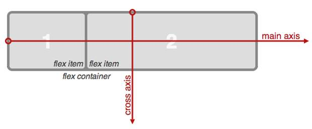
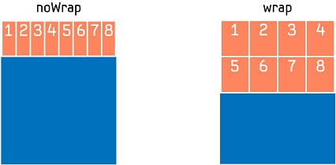
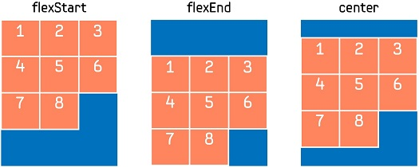
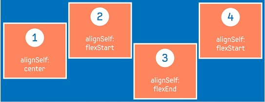
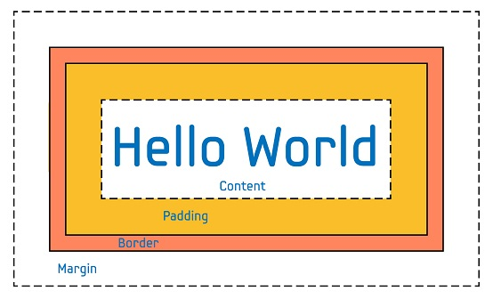

# Flex Container Tutorial

This tutorial describes how to create and use the 'flex container' - `FlexContainer`.

The flex container contains items such as buttons, text labels and images.

[Overview](#overview) 
[Custom properties supported by flex items](#custom-properties) 
[Example of creating Flexbox layout using FlexContainer](#layoutexample) 

## Overview

Flexbox is a CSS3 web layout model which allows responsive elements within a container, automatically arranged to different
size screens or devices.
 
The `FlexContainer` class implements a subset of the `Flexbox` spec. (defined by W3C) at: https://www.w3.org/TR/css-flexbox-1/
 
The flex container has the ability to alter the width and/or height of its children (i.e. flex items) to best fill the available space on
any display device. The container expands items to fill available free space, or shrinks them to prevent overflow.
 
Below is an illustration of the various directions and terms as applied to a flex container with the "flex direction" defined as "row".
 

 
NUI supports the following subset of `Flexbox` properties.

 + [ContentDirection](#content-direction)
 + [FlexDirection](#flex-direction)
 + [FlexWrap](#flex-wrap)
 + [JustifyContent](#justify-content)
 + [AlignItems](#align-items)
 + [AlignContent](#align-content)

### ContentDirection
 
_ContentDirection_ specifies the primary direction in which content is ordered on a line.
 
| LTR (left-to-right) | RTL (right-to-left) |
|--------|--------|
|  |  |
 
The possible values for this property are:
 
| Property Value | Description                                 |
|----------------|---------------------------------------------|
| Inherit        | Inherits the same direction from the parent |
| LTR            | From left to right                          |
| RTL            | From right to left                          |
 
#### Usage

~~~{.cs}
FlexContainer flexContainer = new FlexContainer();
flexContainer.ContentDirection = FlexContainer.ContentDirectionType.RTL;
~~~

[Back to top](#top)

### FlexDirection
 
_FlexDirection_ specifies the direction of the main axis which determines the direction that flex items are laid out.
 

 
The possible values for this property are:
 
| Property Value | Description                                 |
|----------------|---------------------------------------------|
| Column         | The flex items are laid out vertically as a column                          |
| ColumnReverse  | The flex items are laid out vertically as a column, but in reverse order    |
| Row            | The flex items are laid out horizontally as a row                       |
| RowReverse     | The flex items are laid out horizontally as a row, but in reverse order |
 
#### Usage

~~~{.cs}
FlexContainer flexContainer = new FlexContainer();
flexContainer.FlexDirection = FlexContainer.FlexDirectionType.RowReverse;
~~~

[Back to top](#top)

### FlexWrap
 
FlexWrap specifies whether the flex items should wrap, if there is not enough room for them on one flex line.
 

 
The possible values for this property are:
 
| Property Value | Description                                 |
|----------------|---------------------------------------------|
| NoWrap         | Flex items laid out in single line (shrunk to fit the flex container along the main axis) |
| Wrap           | Flex items laid out in multiple lines if needed                                           |
 
#### Usage

~~~{.cs}
FlexContainer flexContainer = new FlexContainer();
flexContainer.FlexWrap = FlexContainer.WrapType.NoWrap;
~~~

[Back to top](#top)

### JustifyContent
 
_JustifyContent_ specifies the alignment of flex items when they do not use all available space on the main axis.
 

 
The possible values for this property are:
 
| Property Value | Description                                 |
|----------------|---------------------------------------------|
| JustifyFlexStart      | Items are positioned at the beginning of the container                     |
| JustifyCenter         | Items are positioned at the center of the container                        |
| JustifyFlexEnd        | Items are positioned at the end of the container                           |
| JustifySpaceBetween   | Items are positioned with equal space between the lines                    |
| JustifySpaceAround    | Items are positioned with equal space before, between, and after the lines |
 
#### Usage

~~~{.cs}
FlexContainer flexContainer = new FlexContainer();
flexContainer.JustifyContent = FlexContainer.Justification.JustifySpaceBetween;
~~~

[Back to top](#top)

### AlignItems
 
_AlignItems_ specifies the alignment of flex items when they do not use all available space on the cross axis.
 

 
The possible values for this property are:
 
| Property Value | Description                                 |
|----------------|---------------------------------------------|
| AlignAuto      | Inherits the alignment from the parent (only valid for "AlignSelf" property) |
| AlignFlexStart | Items are aligned at the beginning of the container |
| AlignCenter     | Items are aligned at the center of the container    |
| AlignFlexEnd   | Items are aligned at the end of the container       |
| AlignStretch    | Items are stretched to fit the container            |
 
#### Usage

~~~{.cs}
FlexContainer flexContainer = new FlexContainer();
flexContainer.AlignItems = FlexContainer.Alignment.AlignFlexStart;
~~~

[Back to top](#top)

### AlignContent
 
_AlignContent_ specifies the alignment of flex lines when they do not use all available space on the cross axis, so only works when
there are multiple lines.
 

 
The possible values for this property are:
 
| Property Value | Description                                 |
|----------------|---------------------------------------------|
| AlignAuto      | Inherits the alignment from the parent (only valid for "AlignSelf" property) |
| AlignFlexStart | Items are aligned at the beginning of the container |
| AlignCenter    | Items are aligned at the center of the container    |
| AlignFlexEnd   | Items are aligned at the end of the container       |
| AlignStretch   | Items are stretched to fit the container            |
 
#### Usage

~~~{.cs}
FlexContainer flexContainer = new FlexContainer();
flexContainer.AlignContent = FlexContainer.Alignment.AlignFlexEnd;
~~~

[Back to top](#top)

## Custom properties supported by flex items

 + [Flex](#flex)
 + [AlignSelf](#align-self)
 + [FlexMargin](#flex-margin)
 
These non-animatable properties are registered dynamically to each child which would be added to the flex container, and once added
their values can not be changed.
 
When a view is added to the flex container, these properties are checked to decide how to lay out the view inside the flex container.

[Back to top](#top)

### Flex
 
By default, the items in the flex container are not flexible. Setting the `Flex` property makes the item flexible, which means the
item can alter its width/height in order to receive the specified proportion of the free space in the flex container. If all items
in the flex container use this pattern, their sizes will be proportional to the specified flex factor. Flex items will not shrink
below their minimum size (if set using the `View` `MinimumSize` method).
 

 
#### Usage

Here is the example code for items to achieve the proportion of free space as illustrated above.
 
~~~{.cs}
// Create the flex container
FlexContainer flexContainer = new FlexContainer();

// Set the flex direction to lay out the items horizontally
flexContainer.FlexDirection = FlexContainer.FlexDirectionType.Row;

// Create flex items and set the proportion
View item1 = new View();
item1.Flex = 1.0f;
flexContainer.Add( item1 );

View item2 = new View();
item2.Flex = 3.0f;
flexContainer.Add( item2 );

View item3 = new View();
item3.Flex = 1.0f;
flexContainer.Add( item3 );

View item4 = new View();
item4.Flex = 2.0f;
flexContainer.Add( item4 );

View item5 = new View();
item5.Flex = 1.0f;
flexContainer.Add( item5 );
~~~

[Back to top](#top)

### AlignSelf
 
_AlignSelf_ specifies how the item will align along the cross axis, if set, this overrides the default alignment for all items defined
by the container’s [AlignItems](#align-items) property.
 

#### Usage

Below is the example code for the items to achieve the alignment on the cross axis as illustrated above.
 
~~~{.cs}

// Create the flex container
FlexContainer flexContainer = new FlexContainer();

// Set the flex direction to lay out the items horizontally
flexContainer.FlexDirection = FlexContainer.FlexDirectionType.Row;

// Set the items to be aligned at the beginning of the container on the cross axis by default
flexContainer.AlignItems = FlexContainer.Alignment.AlignFlexStart;

// Create flex items and add them to the flex container
View item1 = new View();
item1.AlignSelf = FlexContainer.Alignment.AlignCenter; // Align item1 at the center of the container
flexContainer.Add(item1);

View item2 = new View();
flexContainer.Add( item2 ); // item2 is aligned at the beginning of the container

View item3 = new View();
item3.AlignSelf = FlexContainer.Alignment.AlignFlexEnd); // Align item3 at the bottom of the container
flexContainer.Add( item3 );

View item4 = new View();
flexContainer.Add( item4 ); // item4 is aligned at the beginning of the container
~~~

[Back to top](#top)

### FlexMargin
 
Each flex item inside the flex container is treated as a box (in CSS terms) which is made up of:

 + content: The content of the item.
 + padding: The space around the content (inside the border) of the item.
 + border: The border that goes around the padding and the content of the item.
 + flex margin: The space outside the border.
 

 
In NUI, the size of the flex item = content size + padding + border.
 
_flexMargin_ specifies the space around the flex item.
 
#### Usage

~~~{.cs}
// Create the flex container
FlexContainer flexContainer = new FlexContainer();

// Create flex item
View item = new View();

// Add the margin around the item
item.FlexMargin = new Vector4(10.0f, 10.0f, 10.0f, 10.0f);

// Add the item to the container
flexContainer.Add(item);
~~~

[Back to top](#top)

### Example of creating Flexbox layout using FlexContainer

This example creates a Gallery like layout (as shown below) using `FlexContainer`.

 
1. Firstly, we create a flex container as the whole view, and set its resize policy to _fill its parent_ (the parent is _window_).

~~~{.cs}
// Create the main flex container
FlexContainer flexContainer = new FlexContainer();
flexContainer.ParentOrigin = ParentOrigin.TopLeft;
flexContainer.PivotPoint = PivotPoint.TopLeft;
flexContainer.WidthResizePolicy = ResizePolicyType.FillToParent;
flexContainer.HeightResizePolicy = ResizePolicyType.FillToParent;
flexContainer.BackgroundColor = Color.White; // set the background color to be white

// Add it to the window
Window.Instance.Add(flexContainer);
~~~
 
2. Set the flex direction of this main container to _column_, as we want the toolbar and the actual content to be displayed vertically.
 
~~~{.cs}
// Display toolbar and content vertically
flexContainer.FlexDirection = FlexContainer.FlexDirectionType.Column;
~~~
 
3. Now we create a flex container as the toolbar and add it to the main container. Because the flex direction in the main container
   is _column_, the toolbar will be arranged on the top of the main container.
 
~~~{.cs}
// Create the toolbar
FlexContainer toolBar = new FlexContainer();
toolBar.ParentOrigin = ParentOrigin.TopLeft );
toolBar.PivotPoint = PivotPoint.TopLeft;
toolBar.BackgroundColor = Color.Cyan; // Set the background color for the toolbar

// Add it to the main container
flexContainer.Add(toolBar);
~~~

4. We want the buttons and title to display horizontally, and be vertically aligned to the center of the toolbar. Therefore set the
   toolbar flex direction to _row_, and set its `alignItems` property to _center_. We also want the toolbar to occupy 10 percent of
   the whole vertical space, and the content to occupy the rest of the vertical space. This can be achieved by setting the `Flex` property.
 
~~~{.cs}
toolBar.FlexDirection = FlexContainer.FlexDirectionType.Row; // display toolbar items horizontally
toolBar.AlignItems = FlexContainer.Alignment.AlignCenter;    // align toolbar items vertically center
toolBar.Flex = 0.1f; // 10 percent of available space in the cross axis
~~~
 
5. Then we create a third flex container as the content area to display the image. This container will be in the bottom of the main container.
   We want the item inside it to be horizontally and vertically centered, so that the image will always be in the center of the content area.

~~~{.cs}
// Create the content area
FlexContainer content = new FlexContainer();
content.ParentOrigin = ParentOrigin.TopLeft;
content.PivotPoint = PivotPoint.TopLeft;
content.FlexDirection = FlexContainer.FlexDirectionType.Row;        // display items horizontally
content.JustifyContent = FlexContainer.Justification.JustifyCenter; // align items horizontally center
content.AlignItems = FlexContainer.Alignment.AlignCenter;           // align items vertically center
content.Flex = 0.9f; // 90 percent of available space in the cross axis

// Add it to the main container
flexContainer.Add(content);
~~~
 
6. Now add items to the toolbar. The toolbar will have one button on the left, one button on the right, and a
   title always in the center (regardless of the screen size). To achieve that, we make the title 'flexible' so
   that it will automatically take all the available horizontal space left. We will also add some space around the items
   so that the layout looks nicer.
 
~~~{.cs}
// Add a button to the left of the toolbar
PushButton prevButton = new PushButton();
prevButton.ParentOrigin = ParentOrigin.TopLeft;
prevButton.PivotPoint = PivotPoint.TopLeft;
prevButton.MinimumSize = new Vector2( 100.0f, 60.0f ); // this is the minimum size the button should keep
prevButton.FlexMargin = new Vector4(10.0f, 10.0f, 10.0f, 10.0f); // set 10 pixel margin around the button
toolBar.Add(prevButton);

// Set the button text
PropertyMap labelMap;
labelMap.Add("text", new PropertyValue("Prev"));
labelMap.Add("textColor", new PropertyValue(Color.Black));
prevButton.Label = labelMap;

// Add a title to the center of the toolbar
TextLabel title = new TextLabel( "Gallery" );
title.ParentOrigin = ParentOrigin.TopLeft;
title.PivotPoint = PivotPoint.TopLeft;
title.WidthResizePolicy = ResizePolicyType.UseNaturalSize;
title.HeightResizePolicy = ResizePolicyType.UseNaturalSize;
title.HorizontalAlignment = HorizontalAlignment.Center;
title.VerticalAlignment = VerticalAlignment.Center;
title.Flex = 1.0f; // take all the available space left apart from the two buttons
title.FlexMargin = new Vector4(10.0f, 10.0f, 10.0f, 10.0f); // set 10 pixel margin around the title
toolBar.Add(title);

// Add a button to the right of the toolbar
PushButton nextButton = new PushButton();
nextButton.ParentOrigin = ParentOrigin.TopLeft;
nextButton.PivotPoint = PivotPoint.TopLeft;
nextButton.MinimumSize = new Vector2( 100.0f, 60.0f ); // this is the minimum size the button should keep
nextButton.FlexMargin = new Vector4(10.0f, 10.0f, 10.0f, 10.0f); // set 10 pixel margin around the button
toolBar.Add(nextButton);

// Set the button text
PropertyMap labelMap2 = new PropertyMap();
labelMap2.Add("text", new PropertyValue("Next"));
labelMap2.Add("textColor", new PropertyValue(Color.Black));
nextButton.Label = labelMap2;
~~~

   The above settings enable the application to run on differant sized devices, or when changing the screen
   orientation. The toolbar will expand or shrink based on the available space and the title will always be
   in the center, therefore the layout of the toolbar will remain the same.
 
7. Finally, add the image to the content area.
 
~~~{.cs}
// Add an image to the center of the content area
ImageView imageView = new ImageView( "image.jpg" );
imageView.ParentOrigin = ParentOrigin.TopLeft;
imageView.PivotPoint = PivotPoint.TopLeft;
content.Add(imageView);
~~~
 
[Back to top](#top)
 
